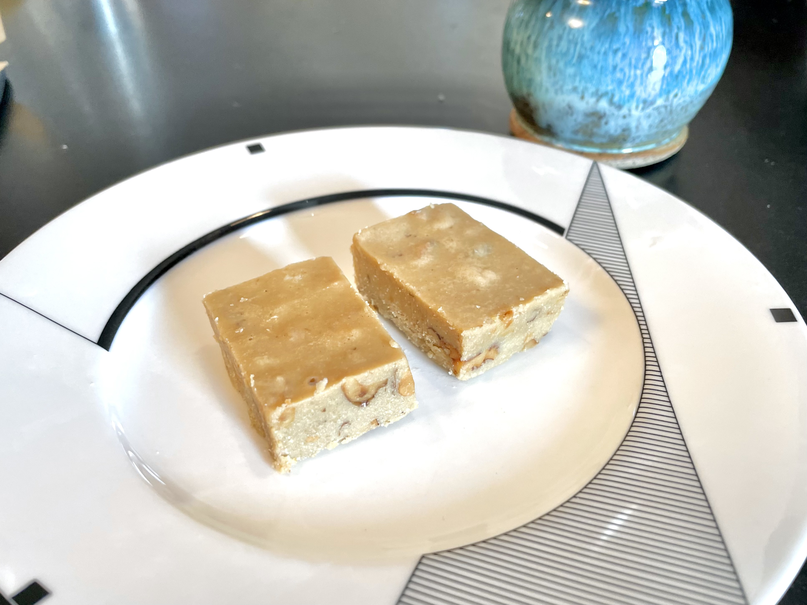

# Tahini Fudge
> Original: 10/07/2023  
> Yield: 16-20 2 inch squares

## 1. Ingredients
- White chocolate chips: 4 oz
- Butter: 4 oz
- Walnuts: 4 oz
- Vegetable oil: some
- Tahini: 1 cup
- Sesame flour: 1.5 cups

## 2. Steps
__Walnuts__
- Toast walnuts lightly sprayed with vegetable oil at 375F for 7 minutes
- Chop walnuts after they cool down a bit

__Fudge mix__
- Melt butter and white chocolate at medium low heat in a pot
- Mix in Tahini and sesame flour and blend with immersion blender
- Keep stirring while heating mix at medium low heat until boiling
- Take mix off heat and blend walnuts in

__Shape__
- Line a square glass container with parchment paper
- Scrape mix into glass container
- Refrigerate until the fudge solidify
- Cut into chunks

## 3. Final Remarks
- Enjoy (with moderation if you can)
