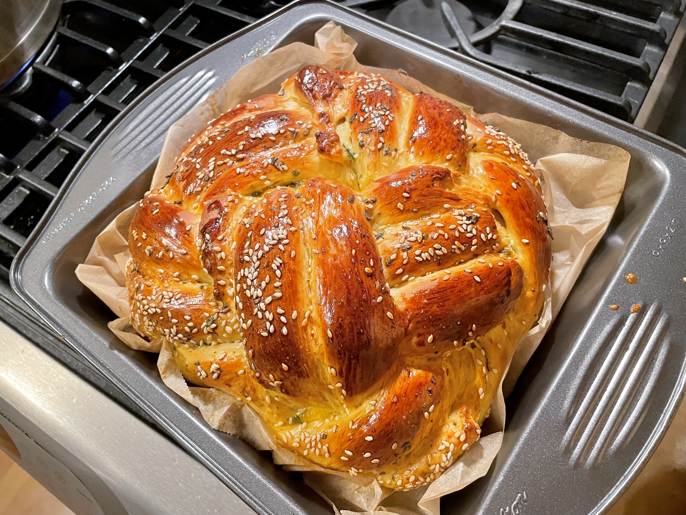
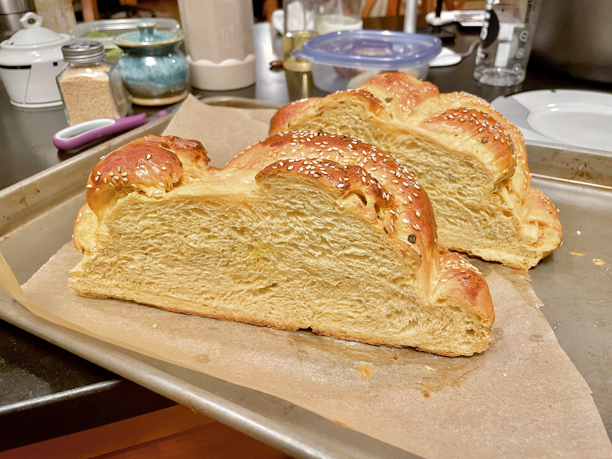

# Butternut Squash Challah
> Original: 09/26/2023  
> Yield: 3 challahs (9 inch loaf)

| 🍫 | ❤️ | 
|----------|----------|
|   |  |

## 1. Ingredients
### 1.1 __Dry__
- All purpose flour: 1kg + 1/2 to 1 cup
- Essential wheat gluten: 40g

### 1.2 __Sage-infused oil__
- Vegetable oil: 6 tbsp (90ml)
- Sage leaves: 16

### 1.3 __Yeast mix__
- Dry yeast: 2 tbsp
- Sugar: 1.5 tsp
- Luke warm water: 1 cup

### 1.4 __Wet ingredients__
- Honey: 0.75 cup
- Salt: 3/4 tbsp
- Butternut squash puree: 1.5 cup
- Eggs: 3
- Egg yolks: 3

### 1.5 __Brushing & Garnishing__
- Egg yolks: 4
- Water: 2 tsp
- Chopped fresh & fried sage leaves and white sesame seeds

## 2. Steps
### 2.1 Sage-Infused Oil
- In a small saucepan over low-medium heat, heat vegetable oil and fresh sage leaves for 5 minutes.  
- Remove from heat, let sit for 25-30 minutes, then strain and finely chop sage leaves.  
   
### 2.2 Yeast Mixture
- In a small bowl, combine yeast, 1 tsp sugar, and lukewarm water.  
- Let sit for 10 minutes until foamy.  
   
### 2.3 Dough
- Combine __sage infused oil__, __yeast mix__, and __wet ingredients__, blend until smooth.
- In a stand mixer bowl, mix all dough ingredients.
- Knead at speed 2 in stand mixer for 10 minutes. Dough should become smooth and elastic.
- Place dough in a greased bowl, cover and let rise in warm place until double (about an hour).

### 2.4 Brushing & Garnishing
- In a small bowl, beat 2 egg yolks with 1 tsp water.
   
### 2.5 Shaping and baking
- Preheat oven to 350 degrees.  
- Divide dough into desired portions.
- Braid dough and let rise for 45-60 minutes.  
- Brush egg wash over challah, sprinkle with chopped sage and white sesame.
- Bake: 27-28 minutes for one large challah, 24-26 minutes for two smaller challahs. Until surface is golden brown.

## References
- [My Jewish Learning: Butternut Squash and Sage Challah](https://www.myjewishlearning.com/the-nosher/butternut-squash-and-sage-challah/)

