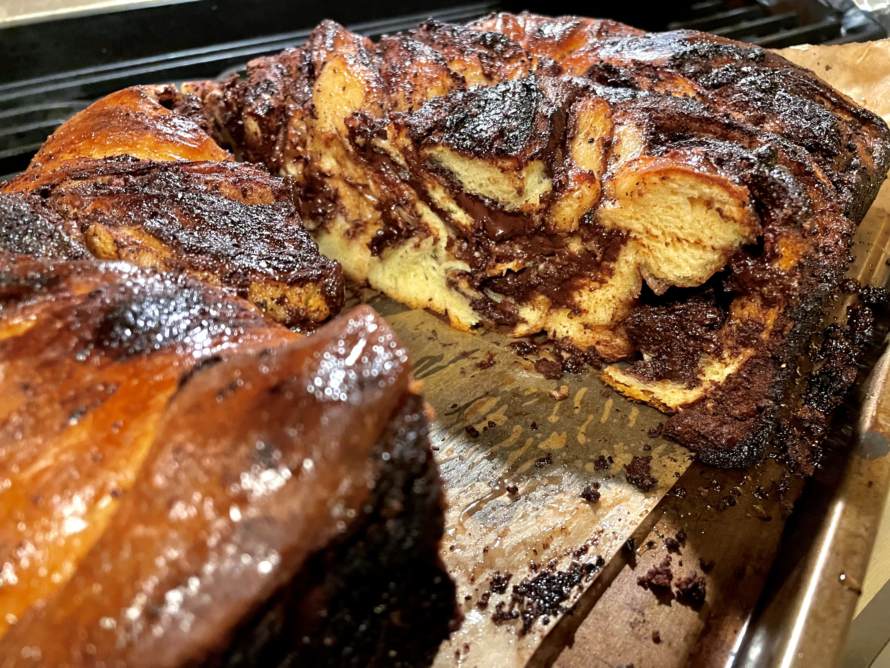

[Main Page](https://yolanda-ht.github.io/YoloCookBlob/)

# Dark Chocolate & Tahini Babka
> Original: 09/26/2023  
> Yield: 2 babkas (9 inch loaf)

| 🍫 | ❤️ | 
|----------|----------|
|   |  |

## 1. Ingredients
### 1.1 Dough mix
- __Yeast__
  - Warm milk: 2/3 cup
  - Granulated sugar: 2 tsps
  - Active dry yeast: 2 sacks or 1.5 tbsp
- __Wet ingredients__
  - Egg: 4 large
  - Egg yolks: 2
  - Salt: 1/2 tsp
  - Granulated sugar: 1/3 cup
- __Dry__
  - All purpose flour: 4 cups
- __Butter__
  - Unsalted butter (room temperature soften): 12 tbsps (divided to 1 tbsp cubes)

### 1.2 Filling
- __Dark chocolate paste__ 
  - Unsalted butter: 1/2 cup
  - Heavy cream: 1/2 cup
  - Chopped bittersweet chocolate wafers: 8 ounces
  - Powdered sugar: 1/3 cup
  - Unsweetened cocoa powder (dutch processed): 1/3 cup
  - Extra chopped chocolate chips: 8 ounces

- __Extra chocolate__
  - Chopped bittersweet chocolate wafers: 4 ounces

- __Tahini paste__
  - Powdered sugar: 1/3 cup
  - Tahini: 3/4 cup
  - Unsalted butter: 1/2 cup

*Chocolate paste and Tahini paste can be either mixed or spread separately (to create marbled bands)*

### 1.3 Syrup for brushing
  - Granulated sugar: 1/4 cup
  - Water: 1/3 cup
  - Honey: 1/3 cup
  - Cardamom: 1/2 tsp

## 2. Steps

### 2.1 Yeast mixture
- In a small bowl, combine everything for yeast mixture
- Let sit for 10 minutes until foamy.

### 2.2 Dough
- Combine __yeast mixture__ and __wet ingredients__, blend until smooth.
- Combine everything for dough except for butter to form a dough ball.
- Add butter one cube at a time, knead at spped 2until each cube is encoperated before adding the next cube.
- Knead for about another 10 minutes until smooth and elastic
- Transfer to an oiled bowl, cover, and chill for 8 hours or overnight.

### 2.3 Filling

__Dark chocolate paste__
- In a saucepan, over low to medium heat, heat butter and cream and chocolate until melted.
- Stir in powdered sugar and cocoa power, blend until smooth.
- Chill in fridge.

__Tahini paste__
- In a saucepan, over low to medium heat, heat tahini paste mix and whisk until smooth.
- Chill in fridge.

__Options__
- Chocolate paste and tahini paste can be either made separately and spread separately to create marbled bands in bread, or mixed together.

### 2.4 Assembly
- Butter and line two 8x4-inch loaf pans with parchment paper.
-  Divide chilled dough in half, roll out one half into a 12x16-inch rectangle.
- Spread half of the filling and spread chocolate wafers evenly, leaving a 1-inch border on one short side.
- Roll dough into a tight coil, pinch seam to seal, then cut in half lengthwise.
- Twist halves together, tuck ends under, and place in a loaf pan.
- Repeat with the remaining dough and filling.
- Let rise in a warm place for 1 1/2 to 2 hours until noticeably puffed.
- Preheat oven to 350F, bake loaves for 40 minutes until golden brown.

### 2.5 Syrup:
- Mix everything for syrup and heat in microwave until slightly boiling.
- Brush syrup on loaves immediately after baking.
- Let babkas cool for 30 minutes

## 3. Serving
- Best served warm
- To heat up: 375F in oven or air fryer for a few minutes, until chocolate inside becomes slightly melty

## Reference
- [Preppy Kitchen: Chocolate Babka](https://preppykitchen.com/chocolate-babka/)
