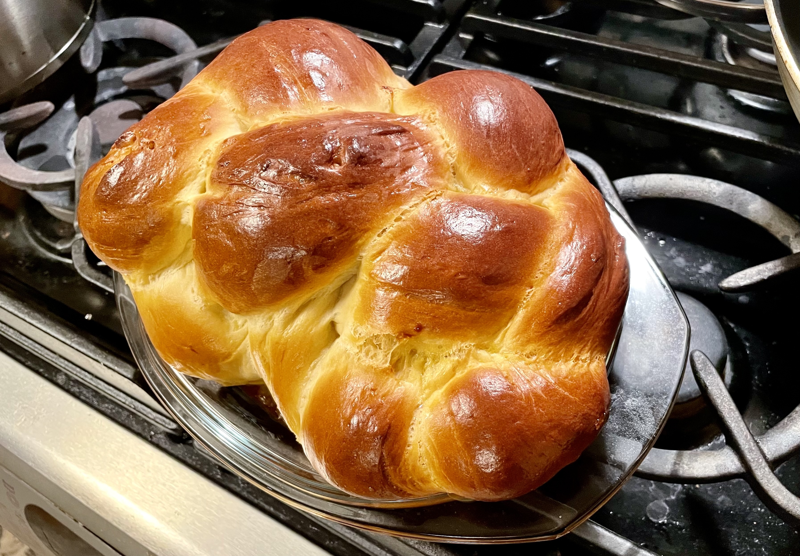

[Main Page](https://yolanda-ht.github.io/YoloCookBlob/)

# Yudane Soymilk Challah
> Original: 02/02/2024  
> Yield: 2 challahs (9 inch loaf)

| 🍞 |
|----------|
|   |

## 1. Ingredients
### 1.1 __Yudane__
- Soy milk: 200g or 3/4 cup
- Bread flour: 40g or 1/3 cup

### 1.2 __Yeast mix__
- (Optional for sweeter bread) Sugar: 12g or 1 tbsp (double if using unsweetened soy milk)
- Yeast: 7g or 2 1/2 tsp
- Luke Warm Soy milk: 125g or 1/2 cup

### 1.3 __Bread__
- Flour: 570g - 600g or 4 3/4 cups - 5 cups (adjust based on your flour's water absorbance)
- Egg yolks: 5
- Salt: 8g or 1/2 tbsp
- Honey: 115g or 1/3 cup
- Oil: 75g or 1/3 cup

### 1.5 __Egg wash__
- Egg: 1
- Water: 1 tbsp

### *The flour mix I used*: 
- 560g (4 2/3 cups) all purpose flour + 20g (2 2/3 tbsps) vital wheat gluten flour
- About equivalent to 1:1 mix of bread flour and all purpose flour
- Can also use bread flour or all purpose flour

## 2. Steps
### 2.1 Yudane
- In a small pot, stir together soy milk and bread flour. Combine well.
- Heat over medium low heat and stir frequently until temperature registers 149° F.
- Remove the Yudane from pot in a bowl to prevent overcooking and let it cool.

### 2.2 Yeast Mixture
- In a small bowl, combine yeast, sugar, and lukewarm yeast.  
- Let sit for 10 minutes until foamy.  
   
### 2.2 Dough
- Combine __Yudane__, __yeast mix__, and __bread ingredients__, blend well.
- In a stand mixer bowl, mix all dough ingredients.
- Knead at speed 2 in stand mixer for 10 minutes. Dough should become smooth and elastic.
- Place dough in a greased bowl, cover and let rise in warm place until double (about an hour to an hour and half).

### 2.4 Prepare egg wash
- In a small bowl, beat egg with water.
   
### 2.5 Shaping and baking
- Preheat oven to 350 degrees.  
- Divide dough into 2 portions.
- For each portion, further divide the dough to number of strands you like. Shape into long cylinders for braiding.
- Braid dough. [How to braid challah](https://laurenmonaco.com/MintysTable-Challah-Diagrams)
- COver losely and let rise until doubles.  
- Brush egg wash over challah.
- Bake for 25-35 minutes, or until surface is golden brown.
