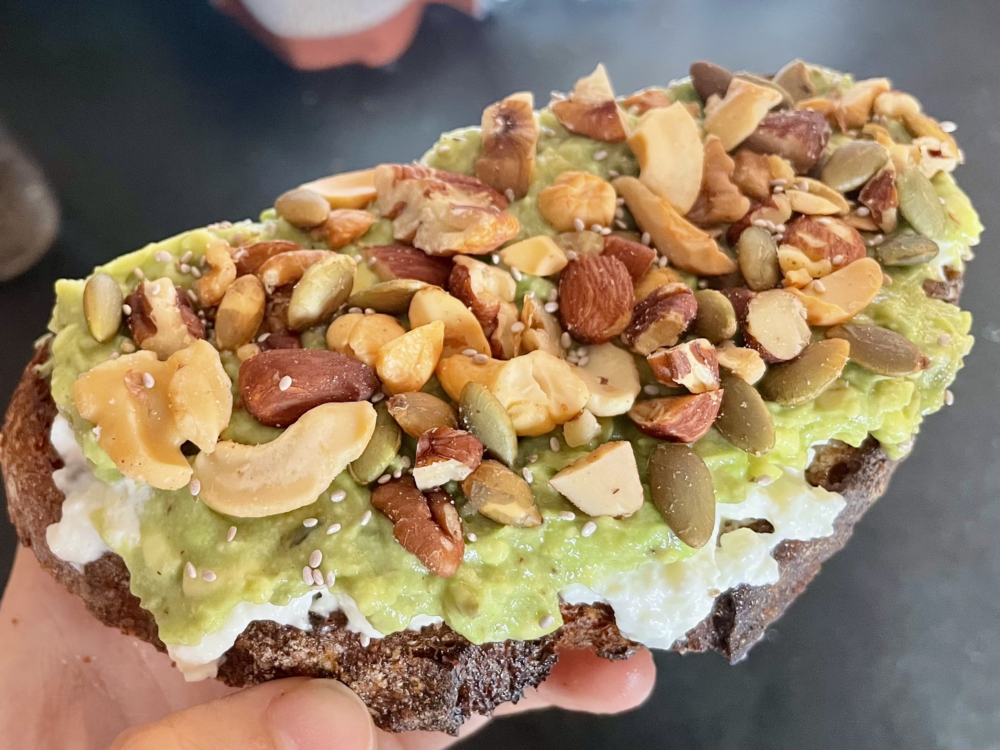

[Main Page](https://yolanda-ht.github.io/YoloCookBlob/)

# California Avocado Toast
> Origin: 03/23/2023  
> Yield: 2 servings
>

| 🥑 | 🍞 |
|----------|----------|
|   |  |

## 1. Ingredients

### 1.0 Toast
- Whole wheat bread slice: 2 (we like 7 star seed bread)
- Olive oil: some (to spray)

### 1.1 Spreads
- Burrata: 2 oz
- Mashed avocado: 1 ripe avocado
- Lime juice: 1/2 tsp

### 1.2 Toppings
- Mixed roasted nuts: 3 oz
  - Chopped: Pecans, walnuts, cashews
  - Pepitas
- Chia seeds: some
- Arugula: some
- Other greens (protein gressn or sprouts): some
- Fried eggs: 4
- Black pepper: some

## 2. Steps

### 2.0 Prepare roasted nuts
- Roughly chop nuts and mix with pepitas
- Spay with vegetable oil and mix well
- Bake at 350F for 10 minutes or until slightly golden and fragrant
- Cool completely

### 2.1 Eggs and toast
- Make 4 overeasy eggs on a non stick fry pan
- Spray toast slices with olive oil and heat both sides of toast sices on the fry pan until golden

### 2.2 Mashed avocado
- Mash avocado and mix with lime juice

### 2.2 Assemble
- Spread burrata on toast
- Spread mashed avocado on top of burrata
- Cover with nuts and chia seeds on top of avocado
- Add arugula and other greens
- Top with 2 eggs
- Finish with some freshly cracked black pepper on top
