[Main Page](https://yolanda-ht.github.io/YoloCookBlob/)

# Salad Planner
> Updated: 03/04/2023

*In memory of the my cutest salad lover, Pandas*  

- Daily % of nutrition values: based on **1 CUP** (240ml)
- Daily calorie calculation: based on 1800 Cal diet
- Calorie Density: calories / weight (g)

## Leafy Greens
|  |  |  |  |  |
| :--- | :--- | :--- | :--- | :--- |
| 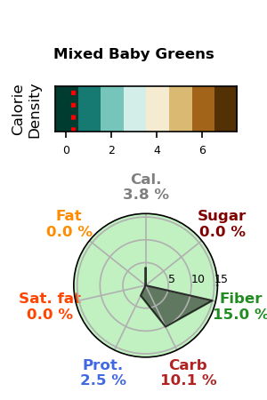||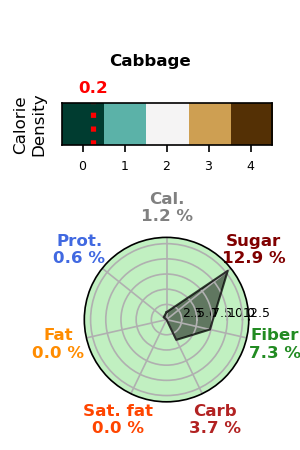|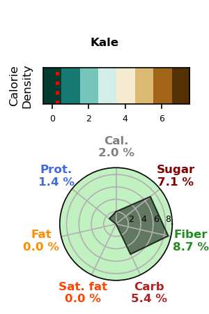|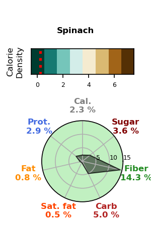 |
| |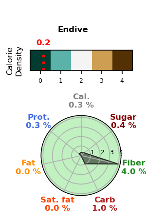|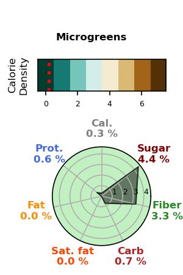|| |

## Raw Unseasoned Veggies
|  |  |  |  |  |
| :--- | :--- | :--- | :--- | :--- |
| 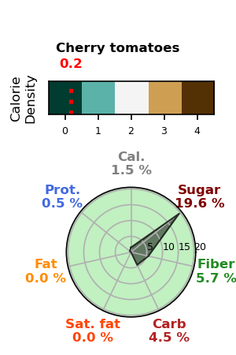|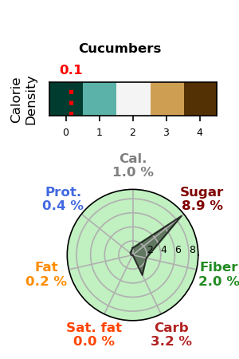||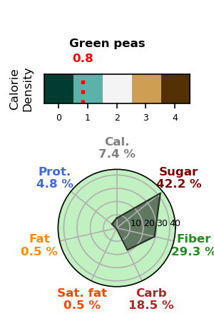|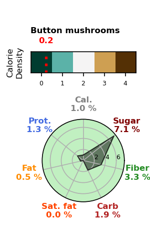 |
| 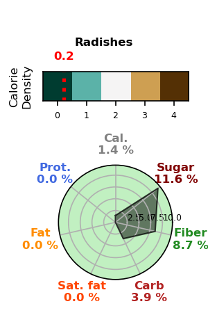|.png)||| |

## Light Dressing Seasoning
|  |  |  |  |  |
| :--- | :--- | :--- | :--- | :--- |
| 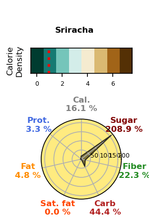|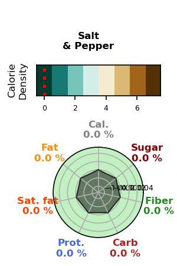|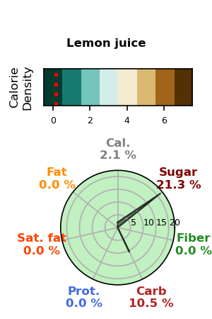|| |

## Fruits
|  |  |  |  |  |
| :--- | :--- | :--- | :--- | :--- |
| ||||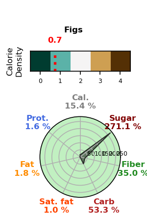 |
| ||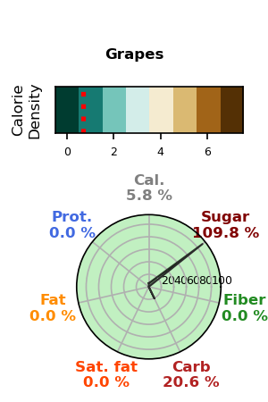|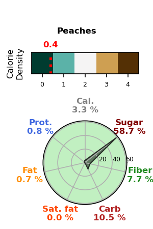|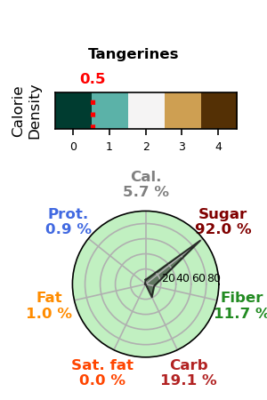 |

## Seasoned Cooked Veggies
|  |  |  |  |  |
| :--- | :--- | :--- | :--- | :--- |
| .png)|.png)||| |

## Herb Flavor
|  |  |  |  |  |
| :--- | :--- | :--- | :--- | :--- |
| |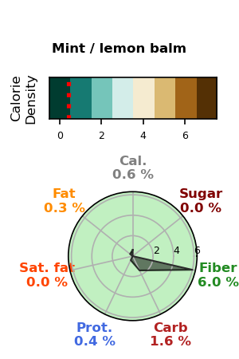|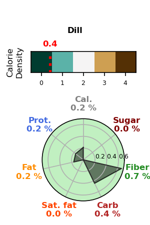|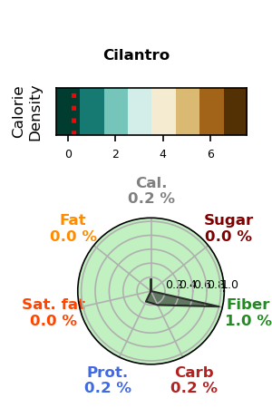|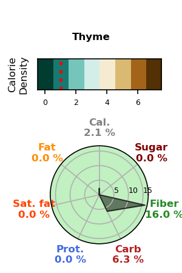 |
| 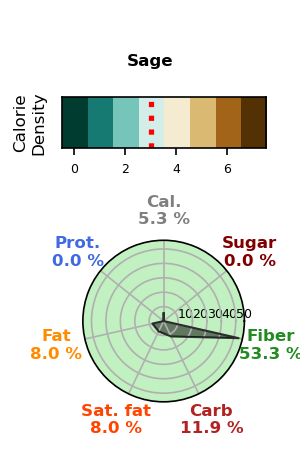|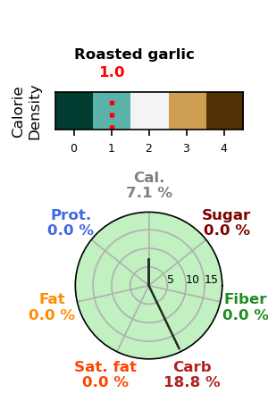|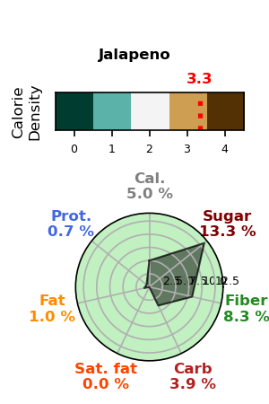|.png)|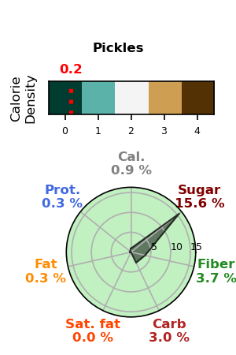 |

## Carb
|  |  |  |  |  |
| :--- | :--- | :--- | :--- | :--- |
| .png)|.png)|.png)|.png)|.png) |
| .png)|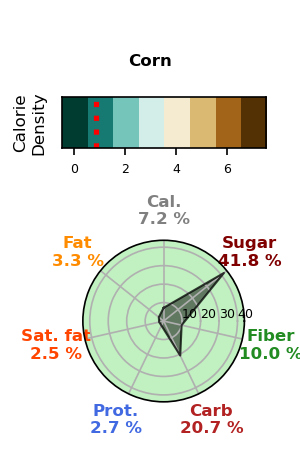|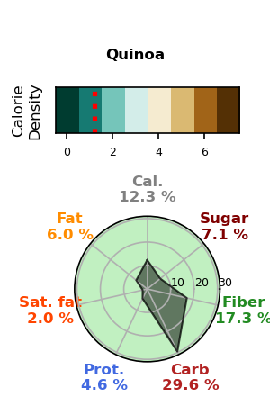|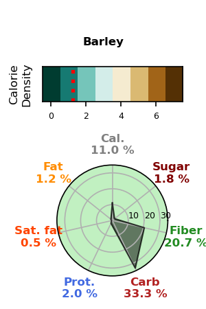|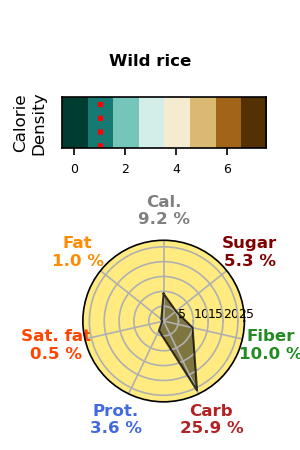 |
| 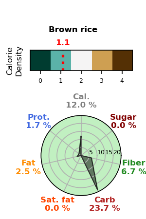|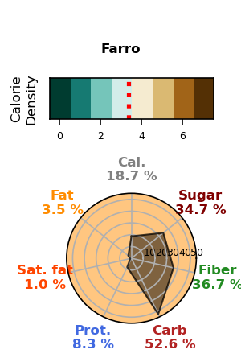|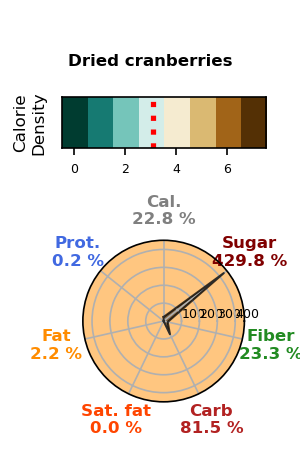|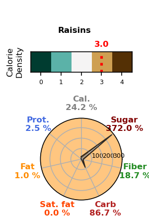|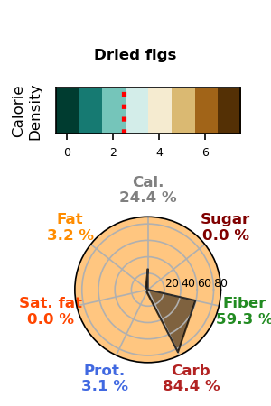 |
| 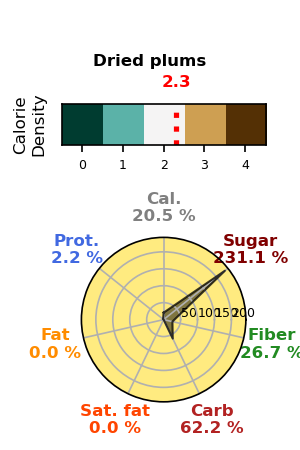|||| |

## Protein Fat
|  |  |  |  |  |
| :--- | :--- | :--- | :--- | :--- |
| 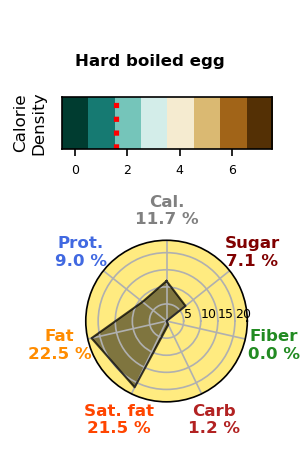|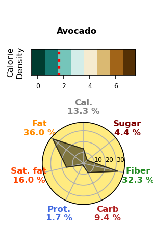|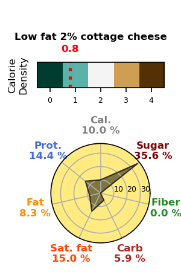|.png)|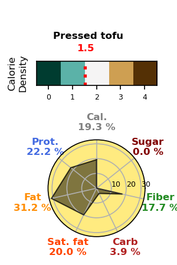 |
| 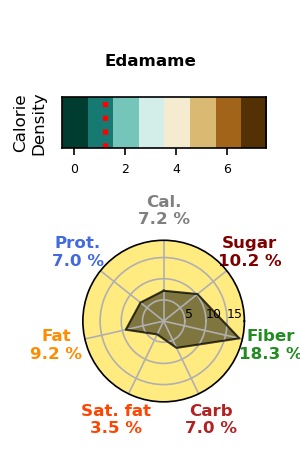|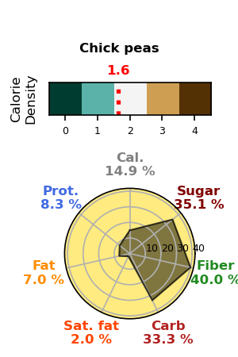|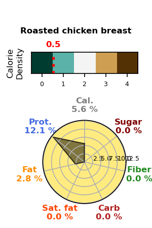|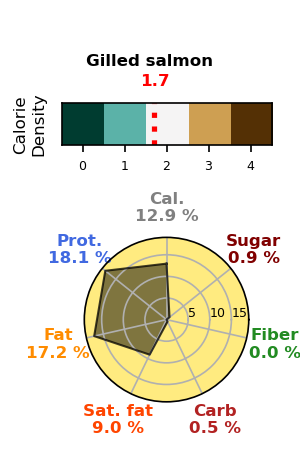|.png) |
| 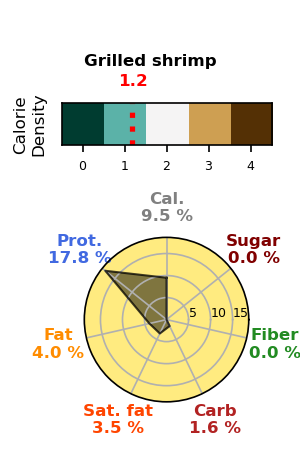|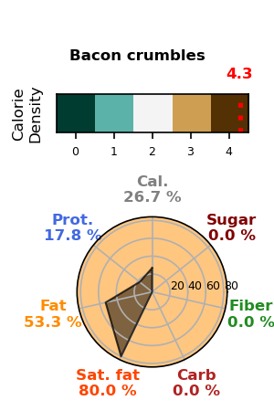|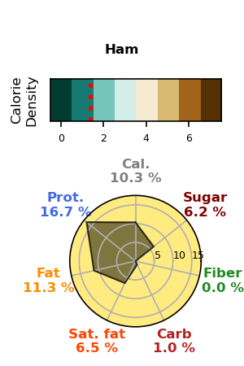|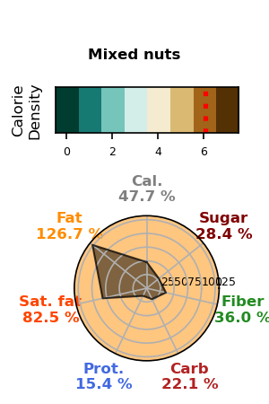| |

## Heavy Dressing Seasoning
|  |  |  |  |  |
| :--- | :--- | :--- | :--- | :--- |
| 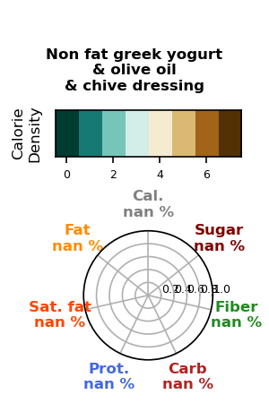|||| |

